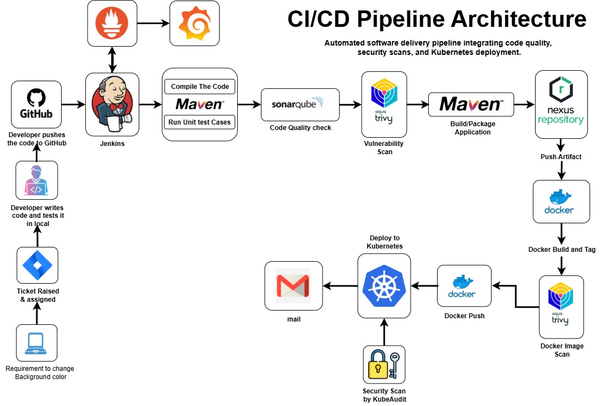

# CICD-DevOps-Pipeline for Boardgame-webapp

## Project-Overview

This project implements a complete **CI/CD DevOps pipeline** for deploying the **Boardgame Web Application**. It demonstrates how to automate the build, test, and deployment process using modern DevOps tools like **Jenkins, Docker, Kubernetes, and SonarQube**. The pipeline ensures **high-quality code**, **secure builds**, and **reliable deployment** to the Kubernetes environment.

## **Boardgame Web Application Repository**

[https://github.com/Shreeja042-sai/Boardgame-webapp](https://github.com/Shreeja042-sai/Boardgame-webapp)

## Project Architecture

The architecture illustrates how the application flows from **code commit** to **deployment in Kubernetes**, including CI/CD stages, containerization, image scanning, and monitoring.

Below is the architecture diagram for the CI/CD DevOps Pipeline:

## CI/CD Pipeline Stages

**Git Checkout**
   - Pulls the latest code from the [Boardgame Webapp](https://github.com/Shreeja042-sai/Boardgame-webapp) repository.

**Compile & Test**
   - Compiles the application using Maven.
   - Runs unit tests to ensure code correctness.

**File System Security Scan**
   - Scans project files for vulnerabilities using **Trivy**.
   - Generates `trivy-fs-report.html`.

**SonarQube Analysis & Quality Gate**
   - Performs static code analysis.
   - Checks for bugs, code smells, and vulnerabilities.
   - Enforces quality gate to ensure only clean code is deployed.

**Build & Package**
   - Packages the application for deployment.

**Docker Image Creation & Scan**
   - Builds Docker image: `shreeja042/Boardgame-webapp:latest`.
   - Scans Docker image for vulnerabilities (`trivy-image-report.html`).

**Push Docker Image**
   - Pushes the Docker image to **Docker Hub** for deployment.

**Deploy to Kubernetes**

Applies `deployment-service.yaml` to deploy the application in the `webapps` namespace.  
  - Verifies pods are running: `kubectl get pods -n webapps`
  - Checks services: `kubectl get svc -n webapps`

**Email Notification**
   - Sends HTML email with pipeline status, build number, and attached security reports.

## Tools & Technologies Used
- **CI/CD:** Jenkins  
- **Source Control:** GitHub  
- **Build & Package:** Maven, JDK 17  
- **Code Quality:** SonarQube
- **Artifact Repository:** Nexus
- **Security:** Trivy (filesystem & image scans)  
- **Containerization:** Docker  
- **Orchestration:** Kubernetes  
- **Notifications:** Email via Jenkins
- **Prometheus:** Metrics collection
- **Grafana:** Visualization and monitoring dashboards

## How to Run

1. Clone the repository: git clone https://github.com/Shreeja042-sai/Boardgame-webapp
2. Open Jenkins and create a new pipeline using the **Jenkinsfile** provided in the repository.
3. Ensure required credentials are configured in Jenkins:
   - GitHub (git-cred)
   - Docker Hub (Docker-cred)
   - SonarQube (sonar-token)
   - Kubernetes (k8-cred)
4. Trigger the pipeline. Jenkins will automatically build, test, scan, package, and deploy the application.
5. Access the deployed application via the Kubernetes service endpoint.

## Monitoring

- **Prometheus** – Collects metrics like pod status, CPU, and memory usage.  
- **Grafana** – Displays dashboards for application performance and health.

